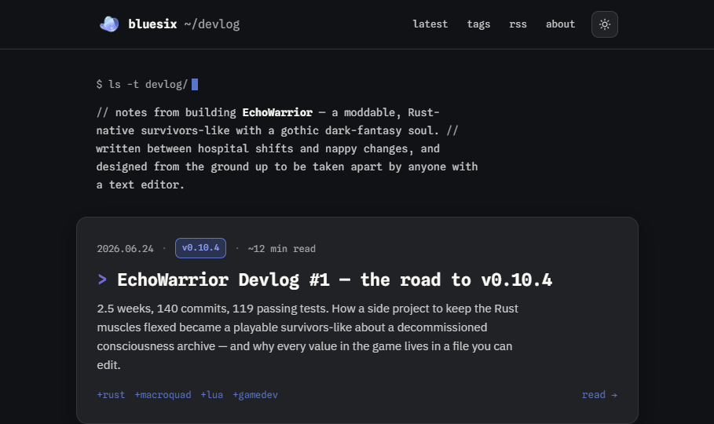

# shisaku devlog

The devlog for **Shisaku**, served at `blog.shisaku.dev` — a terminal-flavoured, dark-first reading experience written in plain HTML/CSS. Notes from building games and tools in the open, starting with **EchoWarrior**.

## Pages

- **`bluesix devlog.html`** — the index / latest feed. Monospace, reverse-chron, build-number badges.
- **`EchoWarrior Devlog 01.html`** — full post reading view: syntax-highlighted code, a stats grid, and asides.
- **`bluesix.css`** — shared theme + components for both pages.

## Theming

Dark-first, with an optional light theme. The toggle (top-right) follows the visitor's system preference on first visit and remembers any manual choice via `localStorage`.

Colours come from a small brand token set defined in `bluesix.css`:

- `primary` — links, active states, mono accents
- `accent-soft` — badges and subtle highlights
- `accent-warm` — brand violet, used sparingly (e.g. the featured `>` caret)
- `surface` / `surface-2` / `border` — depth without high contrast

## Type

- **Spline Sans Mono** — chrome, headings, code, meta
- **IBM Plex Sans** — body prose

## Assets

- `assets/bluesix-mark.png` — the blob mark (works on both themes)
- `assets/favicon.png` — favicon

## Adding a post

Duplicate `EchoWarrior Devlog 01.html`, replace the `.post-head` and `.post-body`, then add a matching `<a class="entry">` block to the feed in `bluesix devlog.html`.
